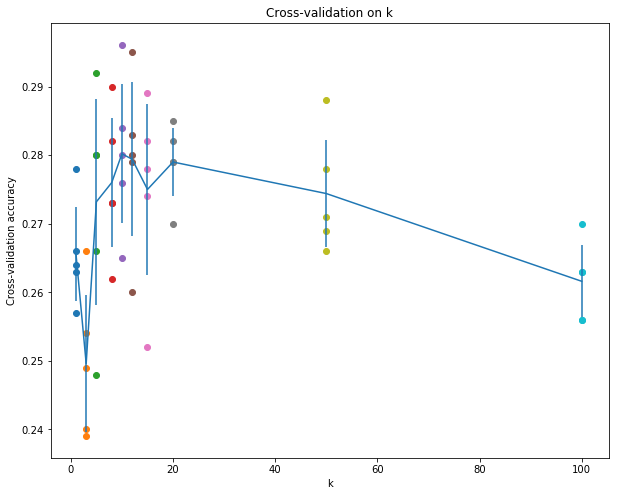

Details about this assignment can be found [on the course webpage](http://cs231n.github.io/), under Assignment #1 of Spring 2017.

-----------------------------------------------------

## 作业（一）中的一些细节

[1. K近邻的无显式循环的写法](#K近邻的无显式循环的写法)

[2. 交叉验证(cross-validation)](#交叉验证(cross-validation))

[3. 一些numpy的函数](#一些numpy的函数)

### K近邻的无显式循环的写法

无显式循环的意思就是使用了矩阵运算而不是for循环得到K近邻中每个测试点和训练点的距离。在这里计算距离的时候使用了l2距离(即欧式距离)。

首先使用两层循环的代码为：

	    for i in range(num_test):
			for j in range(num_train):
				dists[i][j] = np.sqrt(np.sum(np.square(X_test[i] - X_train[j])))

使用一层循环的代码为：

	for i in range(num_test):
		dists[i] = np.sqrt(np.sum(np.square(self.X_train - X[i]), axis=1))
		
不使用显式循环的代码为：

	dists = np.sqrt(-2 * np.dot(X, self.X_train.T) +
                    np.sum(np.square(self.X_train), axis=1) +
                    np.transpose([np.sum(np.square(X), axis=1)]))

最后得出的三种算法的运行时间分别是：

	Two loop version took 62.716137 seconds
	One loop version took 113.113316 seconds
	No loop version took 0.652629 seconds

**无显式循环的实现方法就是将矩阵元素的欧式距离计算公式展开**

### 交叉验证(cross validation)

交叉验证可以用于找到最优的超参数k的值。将训练数据集分成多个folds，依次选择其中的一个fold作为测试集，其余作为训练集。针对不同的k，找到它们的精确度。

**np.array_split**：将向量分成多个部分，array\_split(ary, indices_or_sections, axis=0)

	# 示例
	>>> x = np.arange(9.0)
	>>> np.split(x, 3)
	[array([ 0.,  1.,  2.]), array([ 3.,  4.,  5.]), array([ 6.,  7.,  8.])]

	# 分割数据集
	X_train_folds = np.array_split(X_train, num_folds)
	y_train_folds = np.array_split(y_train, num_folds)

例如分成5个fold，当k=1的时候：

	k = 1, accuracy = 0.263000
	k = 1, accuracy = 0.257000
	k = 1, accuracy = 0.264000
	k = 1, accuracy = 0.278000
	k = 1, accuracy = 0.266000

可视化交叉验证的结果：

	# plot the raw observations
	for k in k_choices:
	    accuracies = k_to_accuracies[k]
	    plt.scatter([k] * len(accuracies), accuracies)
	# plot the trend line with error bars that correspond to standard deviation
	accuracies_mean = np.array([np.mean(v) for k,v in sorted(k_to_accuracies.items())])
	accuracies_std = np.array([np.std(v) for k,v in sorted(k_to_accuracies.items())])
	plt.errorbar(k_choices, accuracies_mean, yerr=accuracies_std)
	plt.title('Cross-validation on k')
	plt.xlabel('k')
	plt.ylabel('Cross-validation accuracy')
	plt.show()

结果如下图所示：

**pyplot.errorbar**：画一条带有误差条的线，plt.errorbar([1,2,3], [1,2,3], yerr=[1,2,3])

	# 示例
	errorbar(x, y, yerr=None, xerr=None, ...)  

### 一些numpy的函数

**flatnonzero**：返回满足参数的值对应的索引

	idxs = np.flatnonzero(y_train == y)  # y_train为向量，y为标量
	
**random.choice**：返回随机选取的n个数

	np.random.choice(idxs, n, replace=False)

**argsort**：返回排序后的值的索引向量

	>>> x = np.array([3, 1, 2])
	>>> np.argsort(x)
	array([1, 2, 0])

**argmax**：返回最大值的索引

	array([[0, 1, 2], [3, 4, 5]])
	>>> np.argmax(a)
	5
	>>> np.argmax(a, axis=0)
	array([1, 1, 1])
	>>> np.argmax(a, axis=1)
	array([2, 2])

**bincount**：桶计数

	>>> np.bincount(np.array([0, 1, 1, 3, 2, 1, 7]))
	array([1, 3, 1, 1, 0, 0, 0, 1])

